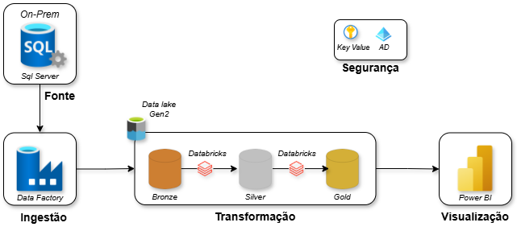
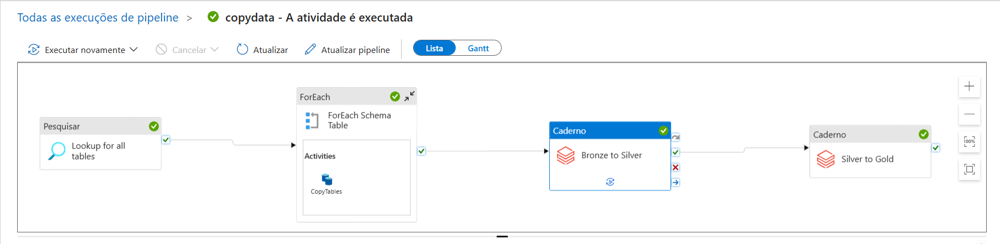

<div align='center'>

# Projeto Engenharia de Dados End-to-End com Azure


</div>
  
---
## Visão Geral
Este projeto demonstra a implementação de um pipeline de dados na Azure aplicando a arquitetura **Medallion**. O fluxo cobre desde a ingestão de dados transacionais _(AdventureWorksLT)_ até a disponibilização para consumo analítico no Power BI.

---
## Arquitetura
A arquitetura segue um fluxo clássico de engenharia de dados:
  - Fonte de dados: base de dados relacional
  - Ingestão: Azure Data Factory
  - Armazenamento: Azure Data Lake Storage Gen2
  - Processamento: Azure Databricks (Spark + Delta Lake)
  - Consumo: Power BI
<div align='center'>
    

</div>
  
---
## Tecnologias Utilizadas:
<div align='center'>
  
Tecnologia | Descrição
:---|:---
SQL Server | Banco de dados (on-premises)
Azure Data Factory| Orquestração e ingestão de dados
Azure Data Lake Storage Gen2 (ADLS)| Armazenamento em camadas
Azure Databricks | Processamento e transformação de dados
Delta Lake | Camada transacional e versionamento
Databricks SQL | Processamento e transformação de dados
Power BI | Consumo analítico
</div>

---
## Estrutura do Data Lake
  
```text
  ADLS/
    ├──Containers/
          ├──bronze/
          ├──silver/
          └──gold/ 
 ```
- Bronze
  - Dados brutos ingeridos do banco relacional
  - Formato _Parquet_
- Silver
  - Processamento inicial do dados
  - Formato _Delta_
- Gold
  - Dados prontos para consumo analítico
  - Estrutura otimizada para BI

---
## Como executar
**1. Criar recursos no Azure**
- Storage account
- Data Factory
- Databricks
- Databricks Access Conector
- Key Vault

**2. Configurar permissões de acesso (RBAC)**

  O Data Factory e o Databricks precisama de autorização adequada para leitura e escrita no ADLS Gen2, bem como acesso seguro aos segredos armazenados no Azure Key Vault.

**3. Vincular Serviços _(Estúdio Data Factory)_**
  
  No Data Factory, foram configurados Linked Services para estabelecer a comunicação entre os serviços do pipeline, incluindo:
  - SQL Server
  - Key Vault
  - ADLS Gen2
  - Databricks

**4. Executar o pipeline de ingestão no Data Factory**
   
    ```
    Pipeline Principal:
    ├── Lookup: Lista tabelas do SalesLT
    ├── ForEach: Processa cada tabela
    └── Copy Data: SQL Server → Data Lake
        ├── Fonte: SELECT * FROM SalesLT.{tabela}
        └── Destino: /bronze/SalesLT/{tabela}.parquet
    ```

**5. Processamento no Databricks**

1ª Etapa:
- Conexão com o ADLS Gen2
- Leitura de dados da camada Bronze

2ª Etapa:
<div align='center'>
    
Notebook|Entrada|Saída|Transformações Principais
:---|:---|:---|:---
bronze_to_silver|/bronze/|/silver/|•Tratamento inicial dos dados<br> •Padronização dos nomes das colunas (snake_case)<br> •Conversão de campos de data para formato `yyyy-MM-dd`
silver_to_gold|/silver/|/gold/|•Garantia de consistência de schemag<br> •Reorganização dos dados por entidade<br> •Formato delta
</div>
  
3ª Etapa:
- Criar tabelas Delta registradas como tabelas SQL
- Conectar o Power BI ao SQL Warehouse_(databricks)_
  
> Os notebooks utilizados neste processo estão disponíveis ao final do projeto para consulta e reprodução do pipeline.[^1]

**6. Automação do Pipeline**

O Data Factory executa a ingestão dos dados na camada Bronze e, em seguida, realiza a chamada automática dos notebooks no Databricks, responsáveis pelas transformações nas camadas Silver e Gold, sem necessidade de intervenção manual.
  

  
> Arquivo JSON com o código utilizado para este pipeline está disponível ao final do projeto para consulta e reprodução.[^2]
  
**7. Consumo Analítico**

O consumo analítico foi realizado a partir da camada Gold, garantindo que os dados estivessem tratados, padronizados e prontos para análise.<br>
Essa abordagem reforça a separação de responsabilidades do pipeline, onde o Databricks é responsável pelo processamento e o Power BI atua exclusivamente na camada de visualização
- Integração do Databricks com o Power BI
- Importação das tabelas via SQL Waherouse
  

  
> Por se tratar de um projeto com foco em Engenharia de Dados, o escopo não contemplou, neste momento, a análise detalhada dos relacionamentos entre as tabelas nem a exploração aprofundada das visualizações, priorizando a construção e automação do pipeline de dados.
  
---
## Considerações Técnicas
- Projeto desenvolvido a partir de um tutorial do canal [Brazil Data Guy](https://www.youtube.com/watch?v=viKANCDhOqo&list=PLjofrX8yPdUQl_Z5w6gM0yet_3XGPSqjV)
- Algumas configurações foram ajustadas em relação ao tutorial original
- Orquestração centralizada no Azure Data Factory
- Transformações concentradas no Databricks
- Parquet foi utilizado na camada Bronze por ser eficiente para ingestão em larga escala.
- Delta Lake foi adotado nas camadas Silver e Gold para garantir consistência de schema, controle transacional e facilidade de evolução do pipeline
- O foco do projeto é Engenharia de Dados, não modelagem analítica
- Possível continuação do projeto no Power Bi trazendo alguns insigts dos dados.

---
## Referências
[AdventureWorks](https://learn.microsoft.com/en-us/sql/samples/adventureworks-install-configure?view=sql-server-ver16&tabs=ssms)<br>
[Conexão Azure Data Lake](https://docs.databricks.com/aws/pt/connect/storage/azure-storage)<br>
[Key Vault](https://learn.microsoft.com/pt-br/azure/data-factory/store-credentials-in-key-vault)<br>
[Medallion Architecture](https://www.databricks.com/br/glossary/medallion-architecture)<br>
[Secret Scope](https://learn.microsoft.com/en-us/azure/databricks/security/secrets/)<br>
[Sistema de Arquivos de Blobs do Azure(ABFSS)](https://learn.microsoft.com/pt-br/azure/storage/blobs/data-lake-storage-abfs-driver)<br>
[Token Databricks](https://docs.databricks.com/aws/pt/dev-tools/auth/pat)

---
## Nota de Rodapé
[^1]:[Storage Access](storage_access.ipynb)<br>[Bronze to Silver](bronzetosilver.ipynb)<br>[Silver to Gold](silvertogold.ipynb)
[^2]:[Pipeline](new_pipeline.json)
