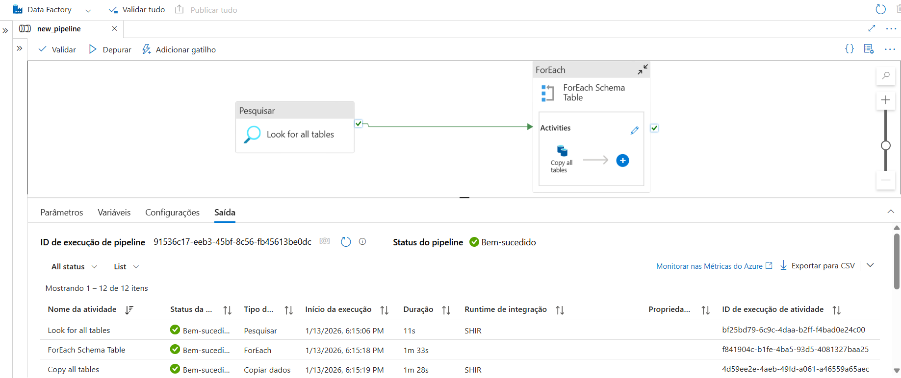
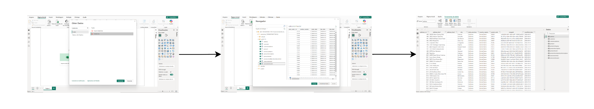

<div align='center'>

# Projeto Engenharia de Dados End-to-End com Azure


</div>

>**Fonte do projeto**
>
>Este projeto foi desenvolvido com base no tutorial do YouTube do canal [Brazil Data Guy](https://www.youtube.com/watch?v=viKANCDhOqo&list=PLjofrX8yPdUQl_Z5w6gM0yet_3XGPSqjV), com adaptações e decisões técnicas próprias.

---

<details>
<summary>Índice</summary>

- [Visão Geral do Projeto](#visão-geral-do-projeto)
- [Tecnologias Utilizadas](#tecnologias-utilizadas)
- [Arquitetura](#arquitetura)
- [Como Executar o Projeto](#como-executar-o-projeto)
- [Considerações Finais](#considerações-finais)
- [Referências](#referências)
</details>

---
## Visão Geral do Projeto
Este projeto demonstra a implementação de um pipeline de dados na Azure aplicando a arquitetura **Medallion**. O fluxo cobre desde a ingestão de dados transacionais _(AdventureWorksLT)_ até a disponibilização para consumo analítico no Power BI.
  
---
## Tecnologias Utilizadas:
<div align='center'>
  
Tecnologia | Descrição
:---|:---
SQL Server | Banco de dados (on-premises)
Azure Data Factory| Orquestração e ingestão de dados
Azure Data Lake Storage Gen2| Armazenamento em camadas
Azure Databricks | Processamento e transformação de dados
Delta Lake | Camada transacional e versionamento
Databricks SQL | Processamento e transformação de dados
Power BI | Consumo analítico
</div>

---
## Arquitetura
A arquitetura estabelecida para o processamento dos dados consiste em:
  - Fonte de dados: base de dados relacional
  - Ingestão: Azure Data Factory
  - Armazenamento: Azure Data Lake Storage Gen2 _(ADLS Gen2)_
  - Processamento: Azure Databricks (Spark + Delta Lake)
  - Consumo: Power BI
### Fluxo do Pipeline
<div align='center'>
    

</div>

### Estrutura do Data Lake
  
```text
  ADLS/
    ├──Containers/
          ├──bronze/
          ├──silver/
          └──gold/ 
 ```
- Bronze
  - Dados brutos ingeridos do banco relacional
  - Formato _Parquet_
- Silver
  - Processamento inicial do dados
  - Formato _Delta_
- Gold
  - Dados prontos para consumo analítico
  - Estrutura otimizada para BI

---
## Como executar o Projeto
_**1. Criar recursos no Azure**_
- Storage account
- Data Factory
- Databricks
- Databricks Access Conector
- Key Vault

_**2. Configurar permissões de acesso (RBAC)**_ <br>
O Data Factory e o Databricks precisam de autorização adequada para leitura e escrita no Data Lake, bem como acesso aos segredos armazenados no Key Vault.

_**3. Vincular Serviços (Estúdio Data Factory)**_<br>
No Data Factory, foram configurados Linked Services para estabelecer a comunicação entre os serviços do pipeline, incluindo:
  - SQL Server
  - Key Vault
  - ADLS Gen2
  - Databricks

_**4. Executar o pipeline de ingestão no Data Factory**_<br>
A ingestão dos dados no ambiente _on-premises_ requer que o Data Factory esteja conectado ao servidor de origem por meio de um **Self-hosted Integration Runtime**, garantindo comunicação entre o ambiente local e a nuvem.
Ao final da execução, os dados são armazenados na camada **Bronze** do Data Lake em formato **Parquet**.

```
Pipeline Principal:
    ├── Lookup: Recupera dinamicamente a lista de tabelas do schema SalesLT
    ├── ForEach: Itera sobre cada tabela identificada
    └── Copy Data: SQL Server → Azure Data Lake Storage Gen2
        ├── Fonte: SELECT * FROM SalesLT.{tabela}
        └── Destino: /bronze/SalesLT/{tabela}.parquet
```
<div align='center'>
Representação da etapa de ingestão
  


</div>

_**5. Processamento no Databricks**_<br>
No Databricks ocorrem as etapas responsáveis por extrair dados da camada Bronze, aplicar transformações, armazená-los na camada Silver e, posteriormente, na camada Gold, padronizar esquemas e prepar os dados para consumo analítico. 

1ª Etapa:
- Conexão com o ADLS Gen2
- Leitura de dados da camada Bronze

2ª Etapa:
<div align='center'>
    
Notebook|Entrada|Saída|Transformações Principais
:---|:---|:---|:---
bronze_to_silver|/bronze/|/silver/|•Tratamento inicial dos dados<br> •Padronização dos nomes das colunas (snake_case)<br> •Conversão de campos de data para formato `yyyy-MM-dd`
silver_to_gold|/silver/|/gold/|•Garantia de consistência de schemag<br> •Reorganização dos dados por entidade<br> •Formato delta
</div>
  
3ª Etapa:
- Criar tabelas Delta registradas como tabelas SQL
- Conectar o Power BI ao SQL Warehouse_(databricks)_
  
> Os notebooks utilizados estão disponíveis na seção final deste repositório.[^1]

_**6. Automação do Pipeline**_<br>
A automação é feita via gatilhos programados no Data Factory, que iniciam o pipeline e chamam automaticamente os notebooks no Databricks, garantindo um fluxo de dados end-to-end sem necessidade de intervenção manual.
<div align='center'>
Representação do pipeline completo e automatizado
  

</div>

> Arquivo JSON com o código utilizado para este pipeline está disponível ao final do projeto para consulta e reprodução.[^2]
  
_**7. Consumo Analítico**_<br>
O consumo analítico foi realizado conectando o Power BI ao Databricks SQL Warehouse, transferindo os dados já em formato de tabelas proporcionando a leitura direta dos arquivos.

<div align='center'>  
Importação dos dados para o Power BI
  

</div>

> Por se tratar de um projeto com foco em Engenharia de Dados, a modelagem analítica detalhada (como análise aprofundada de relacionamentos entre tabelas ou dashboards exploratórios) ficou fora do escopo principal, que priorizou a construção, automação e integração do pipeline de dados.

---
## Considerações Finais

Este projeto demonstra a construção de um pipeline de dados automatizado em ambiente Azure, aplicando design de dados como arquitetura em camadas (Bronze, Silver e Gold), processamento no Databricks, uso do Delta Lake, controle de schemas e orquestração com o Data Factory. 

O foco esteve na ingestão, processamento e disponibilização dos dados para consumo analítico, priorizando escalabilidade, governança e automação. O projeto pode ser facilmente expandido para incluir novas fontes de dados, camadas adicionais de transformação ou análises mais avançadas, servindo como base para soluções de dados em ambientes corporativos.

---
## Referências
[AdventureWorks](https://learn.microsoft.com/en-us/sql/samples/adventureworks-install-configure?view=sql-server-ver16&tabs=ssms)<br>
[Brazil Data Guy](https://www.youtube.com/watch?v=viKANCDhOqo&list=PLjofrX8yPdUQl_Z5w6gM0yet_3XGPSqjV)<br>
[Conexão Azure Data Lake](https://docs.databricks.com/aws/pt/connect/storage/azure-storage)<br>
[Key Vault](https://learn.microsoft.com/pt-br/azure/data-factory/store-credentials-in-key-vault)<br>
[Medallion Architecture](https://www.databricks.com/br/glossary/medallion-architecture)<br>
[Secret Scope](https://learn.microsoft.com/en-us/azure/databricks/security/secrets/)<br>
[Sistema de Arquivos de Blobs do Azure(ABFSS)](https://learn.microsoft.com/pt-br/azure/storage/blobs/data-lake-storage-abfs-driver)<br>
[Token Databricks](https://docs.databricks.com/aws/pt/dev-tools/auth/pat)

---
## Nota de Rodapé
[^1]:[Storage Access](storage_access.ipynb)<br>[Bronze to Silver](bronzetosilver.ipynb)<br>[Silver to Gold](silvertogold.ipynb)
[^2]:[Pipeline](new_pipeline.json)
