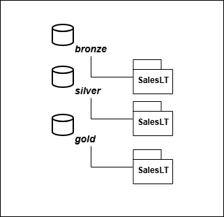
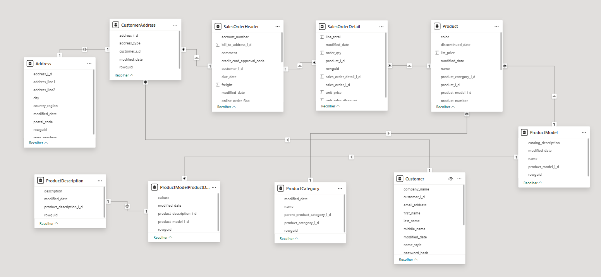

# Azure End-to-End Data Engineering Project

## 1. Visão Geral
Este projeto demonstra a implementação de um pipeline de Engenharia de Dados de ponta a ponta *(end to end)* utilizando serviços da Microsoft Azure. O fluxo cobre desde a ingestão de dados transacionais até a disponibilização dos dados para consumo analítico no Power BI.

O cenário utiliza o banco de dados **AdventureWorksLT**, simulando um ambiente real de dados operacionais.

---

## 2. Arquitetura

 A solução foi construída seguindo o padrão **Medallion Architecture[^1]**:

- **Bronze**: dados brutos ingeridos do SQL Server
- **Silver**: dados tratados e padronizados
- **Gold**: dados prontos para consumo analítico

  

Fluxo dos dados: SQL Server → ADF → ADLS (Bronze/Silver/Gold) → Databricks → Power BI

### Tecnologias Utilizadas:
- **SQL Server:** banco de dados (on-prem)
- **Azure Data Factory**: orquestração e ingestão de dados
- **Azure Data Lake Storage Gen2**: armazenamento em camadas
- **Azure Databricks**: processamento e transformação de dados
- **Power BI**: consumo analítico
---

## 3. Pipeline de Dados

O pipeline foi realizado através do DataFactory em conjunto com o Databricks. No datafactory coletamos on dados no banco on-premises e com o databricks acessamos estes dados[^2], tratamos[^3] e disponibilizamos para consumo[^4]. Os notebooks com os códigos em python estão linkados no final do arquivo.

### 3.1 Ingestão de Dados (Bronze)
- Fonte: SQL Server local (AdventureWorksLT)
- Utilização de **Self-hosted Integration Runtime**
- Extração dinâmica das tabelas do schema `SalesLT`
- Dados salvos em formato **Parquet**

### 3.2 Processamento dos Dados (Silver) 
- Armazenamento das chaves cliente_id e cliente_secret no Secret Scope[^5]
- Definição dos caminhos de acesso ao Azure Data Lake Gen2 utilizando o protocolo ABFSS[^6][^7]
- Padronização dos nomes das colunas (snake_case)
- Conversão de campos de data para formato `yyyy-MM-dd`
- Dados tratados salvos no conteiner silver
 
### 3.3. Disponibilização para Consumo (Gold)
- Padronização dos nomes das colunas
- Validação de schema

### Estrutura do Data Lake

## 4. Consumo Analítico (Power BI)
- Conexão direta do Power BI ao Azure Data Lake Storage Gen2
- Leitura dos dados da camada Gold
- Dados preparados para análise sem necessidade de movimentação adicional
  
Observação: Por limitações de SKU, o consumo Delta no Power BI foi feito via Parquet / não foi possível usar Databricks SQL Warehouse.

---

## 5. Considerações Técnicas
- O projeto foi adaptado para o ambiente **Azure Free Trial**
- Algumas configurações foram ajustadas em relação ao tutorial original
- O foco do projeto é Engenharia de Dados, não modelagem analítica

---

## 6. Fonte
Projeto desenvolvido a partir de um tutorial do canal **Brazil Data Guy**, com adaptações e implementações próprias.

[Projeto Engenharia de Dados End to End](https://www.youtube.com/watch?v=viKANCDhOqo&list=PLjofrX8yPdUQl_Z5w6gM0yet_3XGPSqjV)

## Referências
[^1]:Medallion Architecture: https://www.databricks.com/br/glossary/medallion-architecture
[^2]:Acesso via ABFSS: https://github.com/nadinne94/azure-end-to-end-data-engineer-project/blob/main/storage_access.ipynb
[^3]:Bronze to Silver: https://github.com/nadinne94/azure-end-to-end-data-engineer-project/blob/main/bronzetosilver.ipynb
[^4]:Silver to Gold: https://github.com/nadinne94/azure-end-to-end-data-engineer-project/blob/main/silvertogold.ipynb
[^5]:Secret Scopehttps://learn.microsoft.com/en-us/azure/databricks/security/secrets/
[^6]:Sistema de Arquivos de Blobs do Azure(ABFSS): https://learn.microsoft.com/pt-br/azure/storage/blobs/data-lake-storage-abfs-driver
[^7] Conexão Azure Data Lake: https://docs.databricks.com/aws/pt/connect/storage/azure-storage
